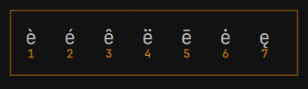

# MacMyKeys

Hold a letter on the Apple keyboard and pick an accent from a numbered row. The character is typed into whichever window is focused.



Hold `e`, then press `4`, and you get **ë**. The row in the picture is è é ê ë ē ė ę. Escape leaves the original letter. Any other key closes the row and is typed as itself.

The same hold works for a, c, d, i, l, n, o, s, t, u, y, and z. The rows are in `config/accents.toml`, and the first run copies that file to `~/.config/macmykeys/accents.toml`.

Backspace, Escape, then Enter quits the watcher and releases the keyboard.

## How it is split

The watcher is a small program that takes the Apple keyboard and forwards every key onward. When a letter is held for about 300ms, it asks the Omarchy shell to draw the row. The chosen accent is entered with the Caps Lock compose sequence already set up on Omarchy, so it reaches a terminal, WhatsApp, and anything else that is focused.

The row itself is only a window. It does not take keys or clicks.

## Build

Install a Rust toolchain, then from this repository:

```bash
cargo build --release
```

The binary is `target/release/macmykeys`.

Check that the keyboard and the virtual keyboard can be opened, without grabbing anything:

```bash
macmykeys --check
```

`--config PATH` reads a different accent file. `--help` prints the flags.

## Install the watcher

```bash
install -Dm755 target/release/macmykeys ~/.local/bin/macmykeys
install -Dm644 dist/macmykeys.service ~/.config/systemd/user/macmykeys.service
systemctl --user daemon-reload
systemctl --user enable --now macmykeys.service
```

The service starts after the graphical session. It restarts itself if it exits.

Opening the keyboard needs membership of the `input` group, and creating the virtual keyboard needs `/dev/uinput` to be in that group too. The `uinput` module has to be loaded.

```bash
sudo usermod -aG input "$USER"
echo uinput | sudo tee /etc/modules-load.d/uinput.conf
sudo modprobe uinput
sudo install -Dm644 dist/99-macmykeys-uinput.rules /etc/udev/rules.d/99-macmykeys-uinput.rules
sudo udevadm control --reload-rules
sudo udevadm trigger --subsystem-match=misc --action=change
```

Log out and back in after joining the `input` group. Until that login, `macmykeys --check` fails even though the udev rule is in place.

## Install the overlay

The panel is an Omarchy shell plugin. Its id is `louan.macmykeys`.

```bash
mkdir -p ~/.config/omarchy/plugins
ln -sfn "$PWD/plugin" ~/.config/omarchy/plugins/louan.macmykeys
```

Add that id to `~/.config/omarchy/shell.json`. The entry has to be an object:

```json
"plugins": [
  { "id": "louan.macmykeys" }
]
```

Reload the shell config:

```bash
omarchy-shell shell reloadConfig
```

The plugin stays loaded and connects to `$XDG_RUNTIME_DIR/macmykeys.sock`. Nothing under `/usr/share/omarchy/` is modified.

## Requirements

- Omarchy, with the Quickshell shell running
- The Apple internal keyboard
- Rust, for the build
- A Linux `uinput` device writable by the `input` group
